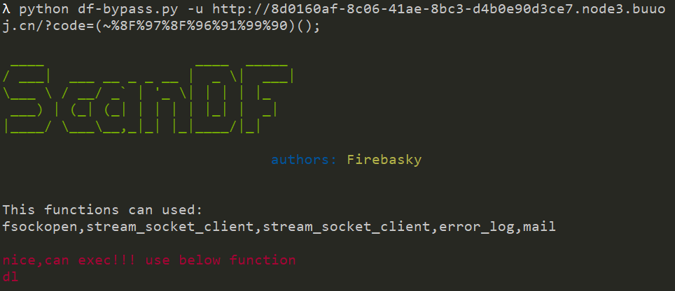
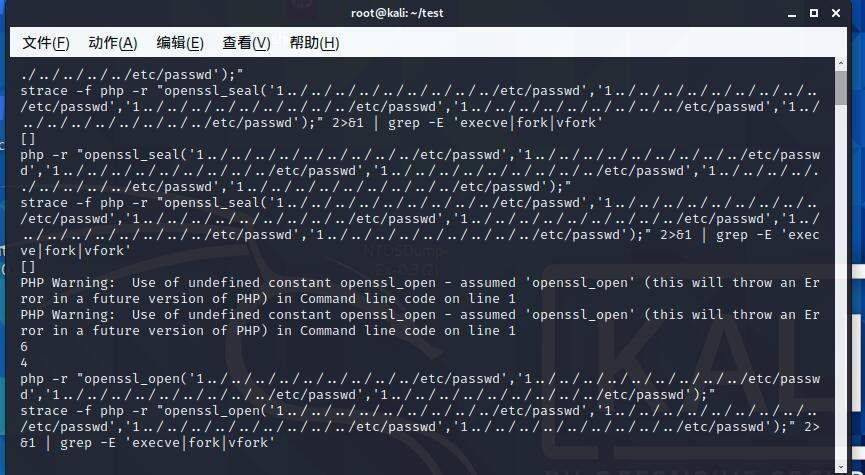

# ScanDF

[中文版本(Chinese version)](README.zh-cn.md)

>The purpose of this script is to bypass disablefund, provide some useful information, and dig the hook function of PHP extension.

### df-bypass.py

Use: Python df-bypass.py - U URL (phpinfo information)

EG1: Test [geek challenge 2019] rce me

You can directly use the hook function to bypass the DL - runtime load a PHP extension

EG2: [Blue Hat Cup 2021] one pointer PHP

Direct hit FPM modify ant sword source code!!

### putenv-ld_preload.py

By bypassing the putenv hook function, we can scan the available functions, load more plug-ins and use them better. It can be used with DF bypass.py

Use: Python putenv LD_ Preload.py (scan the internal value function of the current PHP environment by default)

python putenv-ld_ Preload.py module

Test the function provided by the module, which can better bypass.

>参考：
>
>https://github.com/AntSwordProject/AntSword-Labs/tree/master/bypass_disable_functions
>
>https://blog.bi0s.in/2019/10/26/Web/bypass-disable-functions/
>
>https://www.anquanke.com/post/id/197745

