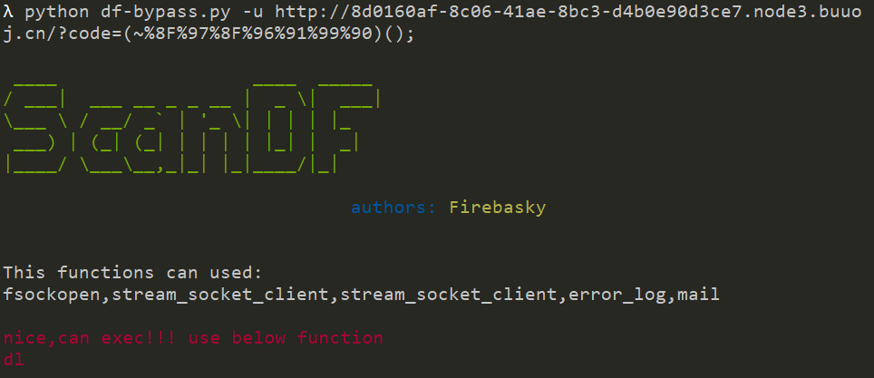
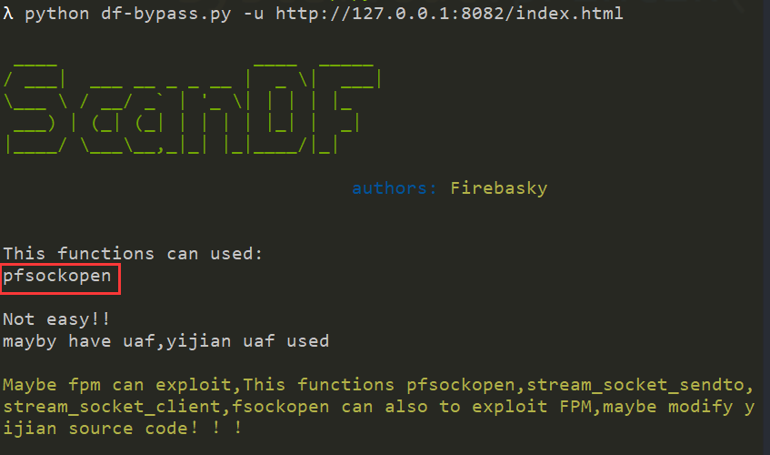

# ScanDF

>该脚本是为了绕过disablefuntion 提供一些可用的信息，和挖php扩展的hook函数。

### df-bypass.py

使用：python df-bypass.py -u url(phpinfo信息)

eg1：测试[极客大挑战 2019]RCE ME

可以直接利用 hook 函数来绕过,dl — 运行时载入一个 PHP 扩展

eg2: [蓝帽杯 2021]One Pointer PHP

直接打fpm 修改蚁剑源代码！！

### putenv-ld_preload.py

**通过putenv hook 函数的原理来绕过，来扫描可用的函数，加载更多的插件能更好的使用，可配合df-bypass.py使用**

使用：python putenv-ld_preload.py  (默认扫描当前php环境的内值函数)

python putenv-ld_preload.py (模块)

测试该模块提供的函数，能更好的bypass。

>参考：
>
>https://github.com/AntSwordProject/AntSword-Labs/tree/master/bypass_disable_functions
>
>https://blog.bi0s.in/2019/10/26/Web/bypass-disable-functions/
>
>https://www.anquanke.com/post/id/197745

